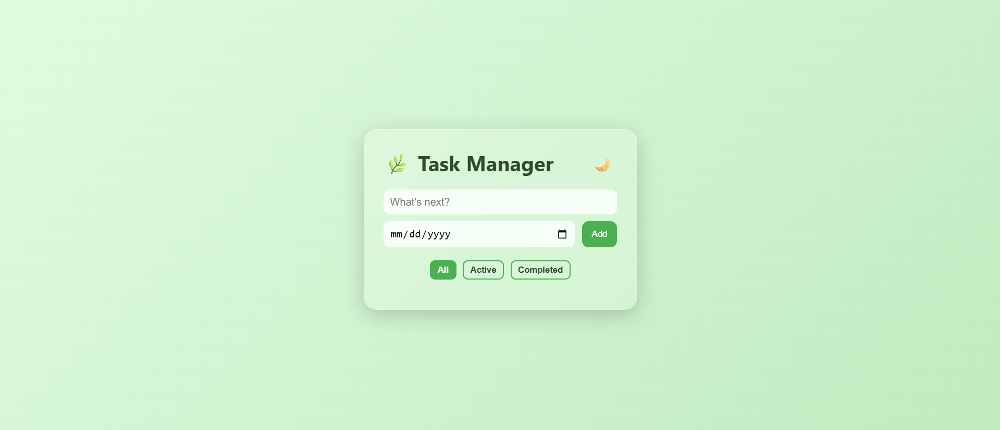

# **To-Do-List-Website**
- A Clean and Minimal Task Manager Web Application that allows you to keep track of your tasks Efficiently.
  Users can add Tasks, Set Deadlines and Filter Tasks by their Status (All, Active, Completed).
  
## ✨ Features
- **Add Tasks** : Quickly Add your tasks with a Description and Due Date.
- **Filter Tasks** : Easily view All, Active or Completed Tasks.
- **Minimal Design** : Simple, Modern and User-friendly Interface.
- **Responsive Layout** : Works well on Desktop and Mobile Devices.

## 🛠 Tech Stack

- **HTML5** – Structure and Layout.
- **CSS3** – Styling, Responsiveness and Themes.
- **JavaScript (ES6)** – Conversion Logic, Interactivity and DOM Manipulation.
- **Google Fonts** – Clean and Modern typography.

## 💡Future Improvements
- **Store tasks in LocalStorage to Persist them Across Sessions.**
- **Add Edit and Delete Functionality for Tasks.**
- **Add Dark Mode Toggle for better Accessibility.**

## 📸Screenshots

Below is a Preview of **To-Do-List-Website**, Showcasing the Layout and Styling implemented Using pure HTML , CSS and Javascript. 
The Design focuses on Clean Structure, Responsiveness and Modern Styling.

